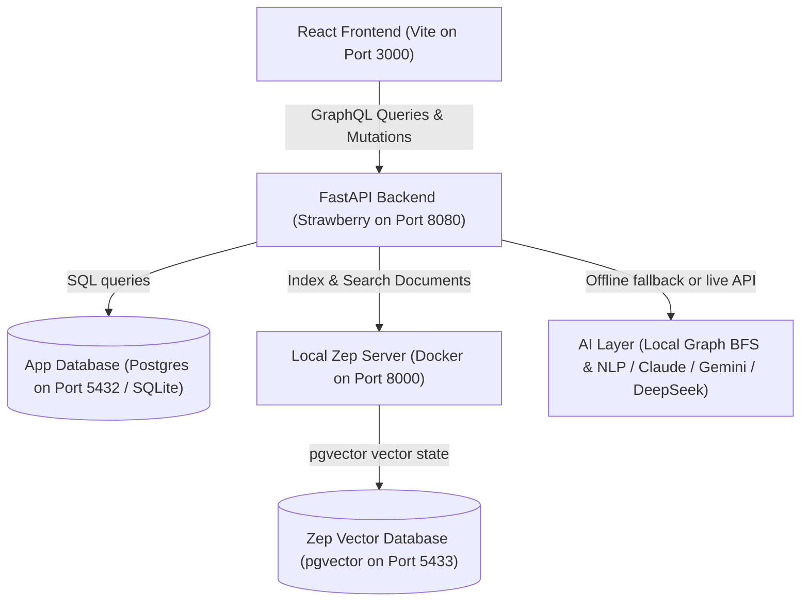

# 🕸️ NetGraph — AI-Powered Relationship Operating System

[](https://opensource.org/licenses/MIT)
[](https://github.com/getzep/zep)

NetGraph is a premium, open-source relationship operating system designed for founders, venture capital partners, advisors, and serious operators who treat relationship knowledge as critical infrastructure. 

Rebuilding the legendary relationship-mapping philosophy of Rockefeller, NetGraph combines a secure personal CRM with a bilateral social graph and an AI memory layer to turn your contact notes into strategic leverage.

---

## 🏛️ Local Architecture Flow

NetGraph is architected as a local-first, multi-container application. By default, it runs 100% locally and offline on your Mac, utilizing Docker containers for memory services, with a graceful SQLite fallback option.



---

## ✨ Features

### 1. Two-Tier Relationship Dossier
- **TEXT Contacts**: Private, enriched dossiers on professionals who do not use NetGraph. Your background notes, worldviews, personal philosophies, and approach strategies stay private and secure.
- **USER Contacts**: When connected with another NetGraph user, your text record upgrades. Deep private notes remain private to you, but their public profile details and connections become visible to map network health.

### 2. Draggable SVG Graph Workspace
- An interactive relationship mapping web built in pure React with inline SVGs.
- Features **active mouse drag-and-throw nodes** with elastic line linkages representing introductions and relational connections.

### 3. AI Chat Workspace (Zep Memory Matrix)
- A terminal-style chat console that queries your network database.
- **Offline NLP & Graph Engine**: If no OpenAI/Gemini/DeepSeek keys are configured, NetGraph uses a custom local Python solver to perform BFS graph pathing (*"Who is my connection path to Palantir?"*), timeline scans (*"Who have I neglected in 90 days?"*), similarity analysis (*"What do Sarah and John have in common?"*), and skill searches.
- **Cloud Models Support**: Seamlessly plugs into Anthropic (Claude), Google (Gemini), or DeepSeek by adding an API key to your environment variables.

### 4. Bilateral Connection Invites
- Search other operators by their permanent `@username` and send a connection invite to securely merge surface-level networks.

### 5. System Settings & Local Data Exports
- PERSISTENT user profiles editable directly from the UI.
- Securely download your entire CRM database as a structured `.JSON` file locally in one click.

---

## 🛠️ Stack Configuration

- **Frontend**: React + Vite + Custom Vanilla CSS (Glassmorphism, custom animations).
- **Backend**: Python FastAPI.
- **API Layer**: Strawberry GraphQL (Python).
- **Database**: Hybrid PostgreSQL (Docker container) / fallback SQLite.
- **AI Memory**: Zep Community Edition (pgvector).
- **Icons**: Lucide Icons.

---

## 🚀 Step-by-Step Local Deployment

Ensure you have **Docker Desktop**, **Python 3.10+**, and **Node.js 18+** installed on your Mac, then follow these instructions:

### 1. Boot up Local Containers
Fires up local PostgreSQL (netgraph-db on port 5432), pgvector (zep-db on port 5433), and the local Zep CE server (port 8000):
```bash
docker-compose up -d
```

### 2. Configure Backend Environment
Navigate to the backend directory, copy the template, and start the FastAPI service:
```bash
cd backend
cp .env.example .env

# Initialize virtual environment
python3 -m venv venv
source venv/bin/activate

# Install dependencies & run backend
pip install -r requirements.txt
uvicorn main:app --port 8080 --reload
```
*On startup, the backend auto-migrates database tables and registers a `@demo` account preloaded with 5 detailed contacts, timeline logs, and relationships to instantly populate your dashboard!*

### 3. Configure & Run React Frontend
Open a new terminal window:
```bash
cd frontend
npm install
npm run dev
```
*The local proxy inside `vite.config.ts` automatically maps GraphQL endpoint requests from port `3000` to `8080`.*

---

## 🔑 Seeded Demo Profile Credentials

Log in directly on `http://localhost:3000` to test the complete environment:
- **Username**: `demo`
- **Password**: `password123`

---

## ⚖️ License

NetGraph launches as fully open source under the [MIT License](LICENSE).
# NetGraph
